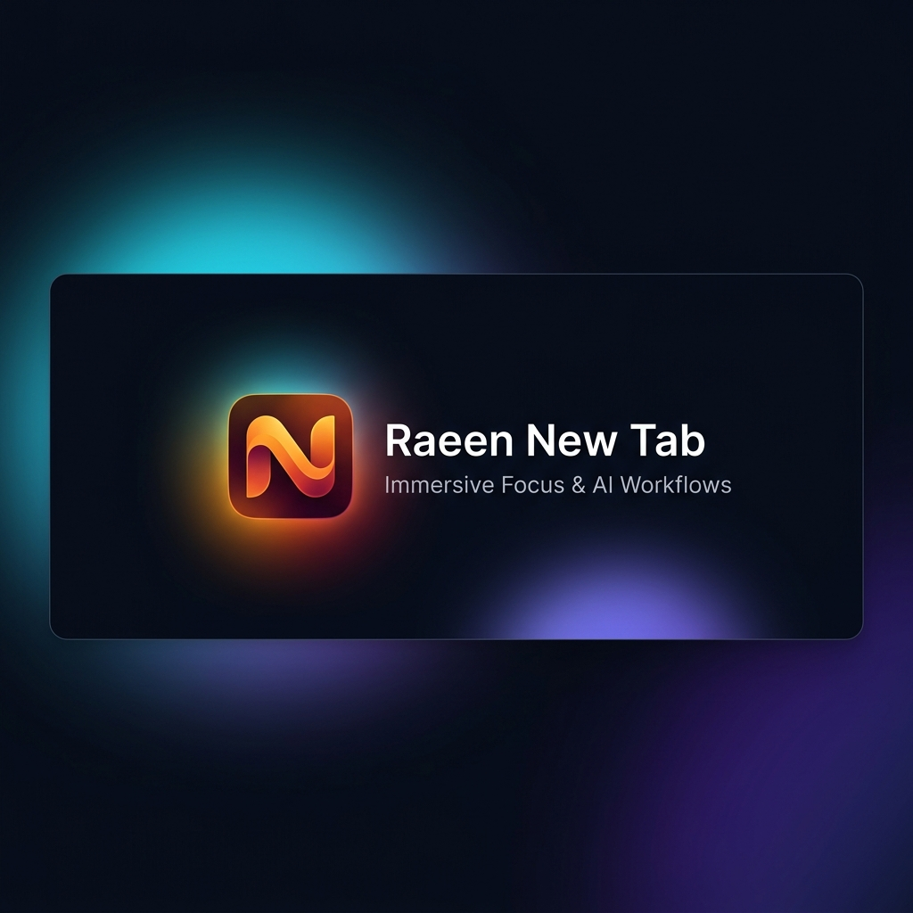
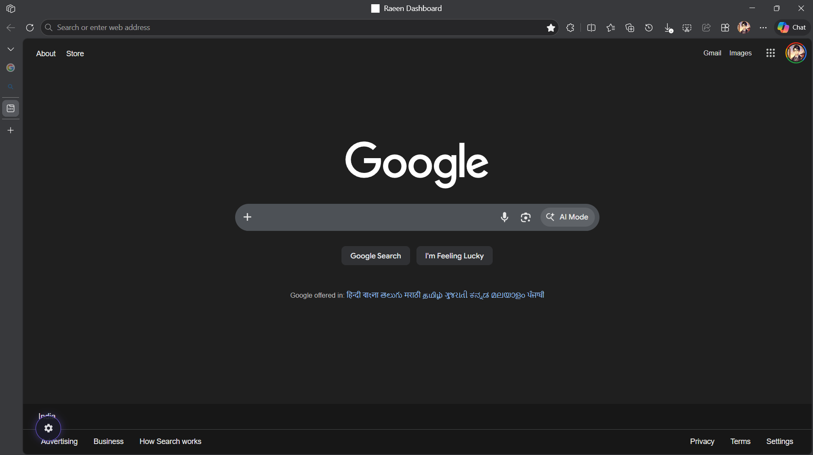
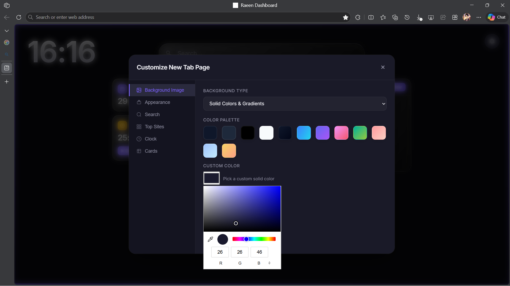
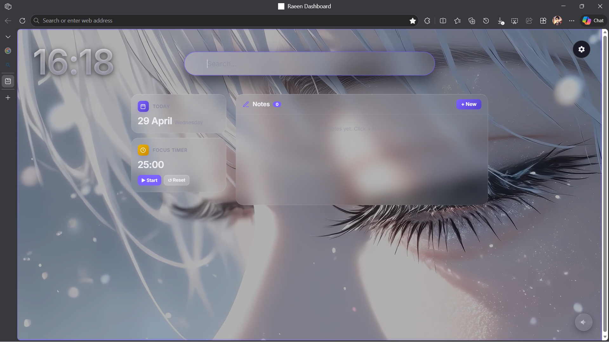
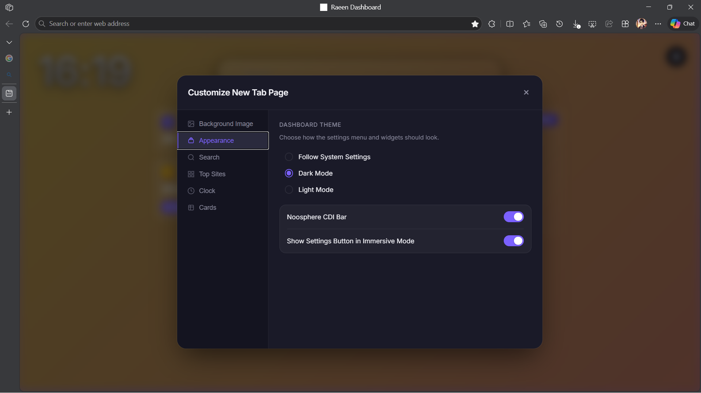
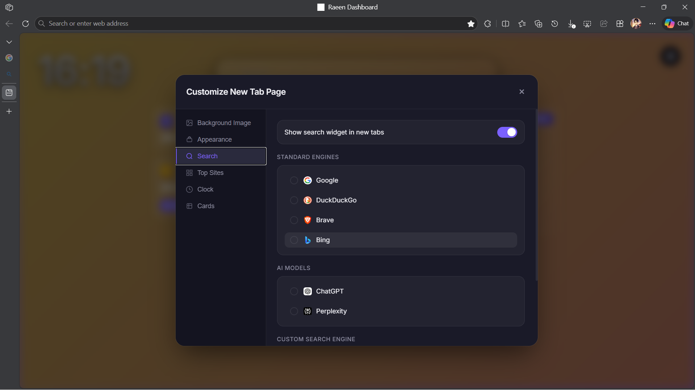
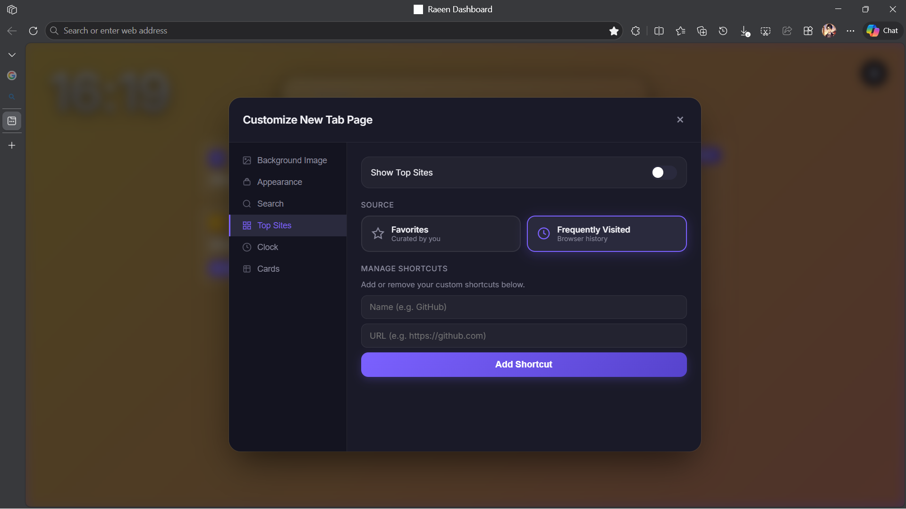
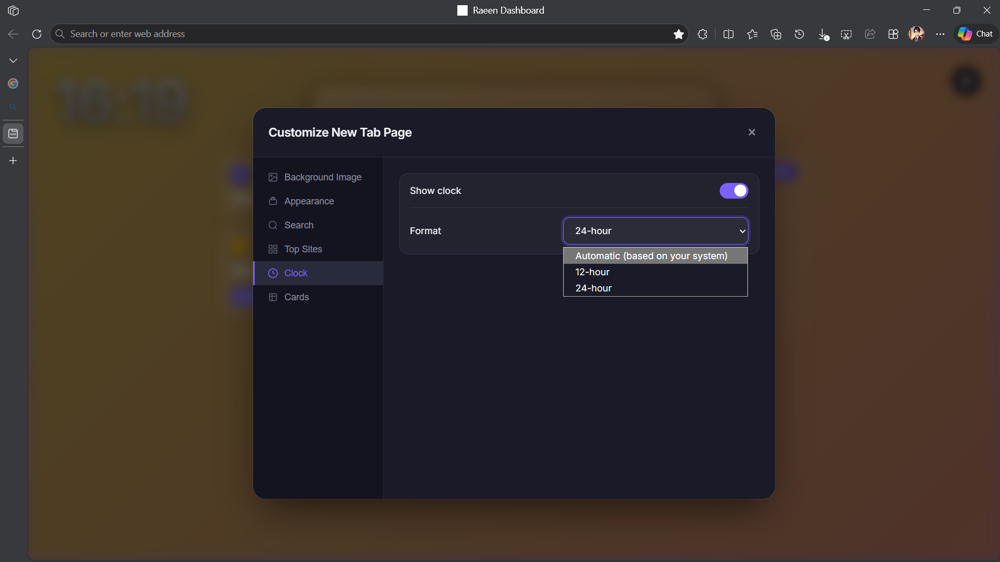
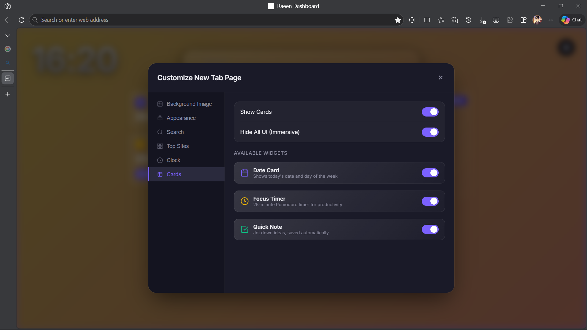

# Raeen Dashboard Pro v2.0.0

<p align="center">
  
</p>

A premium, minimalist new tab dashboard for Chrome and Edge. Designed for productivity with integrated AI workflows, glassmorphism aesthetics, and high-performance search engine transitions. Built using **WXT** (Vite + TypeScript) for optimal Manifest V3 security, modularity, and lightning-fast compilation.

## 📸 Gallery

<p align="center">
  
  
  
  
  
  
  
  
  
  
</p>

## 🚀 Key Features

- **Native Search Redirect**: Seamlessly frame Google or Bing as your dashboard with persistent sign-in.
- **Zero-Flash Preloader**: Ultra-fast routing logic that completely eliminates the 1-second white flash delay during tab initialization.
- **AI-First Workflows**: Instant query execution across ChatGPT, Gemini, Claude, and Perplexity directly from your dashboard.
- **Dynamic Sound Integration**: High-definition video wallpapers with real-time audio playback controls and volume persistence.
- **Secure Backup Schema**: Zod-powered data structure validation for importing and exporting dashboard settings safely.
- **Premium Metasurface UI**: Sleek dark-mode glassmorphism design with responsive micro-animations and custom theme engine.
- **Privacy First**: All configurations and notes are kept strictly inside your local browser storage. No trackers, no telemetry, no data collection.

---

## 🛠️ Developer Setup & Commands

This extension is built on **WXT** (a next-generation web extension framework powered by Vite).

### Installation (Local Dev)
1. Clone this repository or download the source code.
2. In the project root, install dependencies:
   ```bash
   pnpm install
   # Or using npm
   npm install
   ```
3. Start the hot-reloading development server:
   ```bash
   pnpm dev
   # Or using npm
   npm run dev
   ```

### Loading the Unpacked Extension in Chrome/Edge
1. Open Chrome/Edge and go to `chrome://extensions` or `edge://extensions`.
2. Enable **Developer Mode** (toggle button in top right).
3. Click **Load unpacked**.
4. Select the `.output/chrome-mv3` folder (generated automatically when running the dev server or build script).

---

## 📦 Build & Package Commands

For building and preparing store-ready deployment packages:

| Command | Action | Output Location |
| :--- | :--- | :--- |
| `npm run build` | Compiles a production-ready unpacked extension | `.output/chrome-mv3/` |
| `npm run zip` | Compiles and packages extension into a production `.zip` | `.output/wxt-react-starter-2.0.0-chrome.zip` |

---

## 🎨 Branding & Visual Assets

* **Extension Icons**: Located in [public/icon/](public/icon/) (`16.png`, `32.png`, `48.png`, `96.png`, `128.png`). These are automatically optimized and bundled on every build.
* **Store Listing Assets**: Includes your custom cropped transparent superellipse "N" logo and a pre-rendered premium **440x280px Store Listing Banner** for promotional purposes.

---

## 📄 License
This project is licensed under the MIT License - see the [LICENSE](LICENSE) file for details.

---
Built with ❤️ by Abdussamad Raeen
