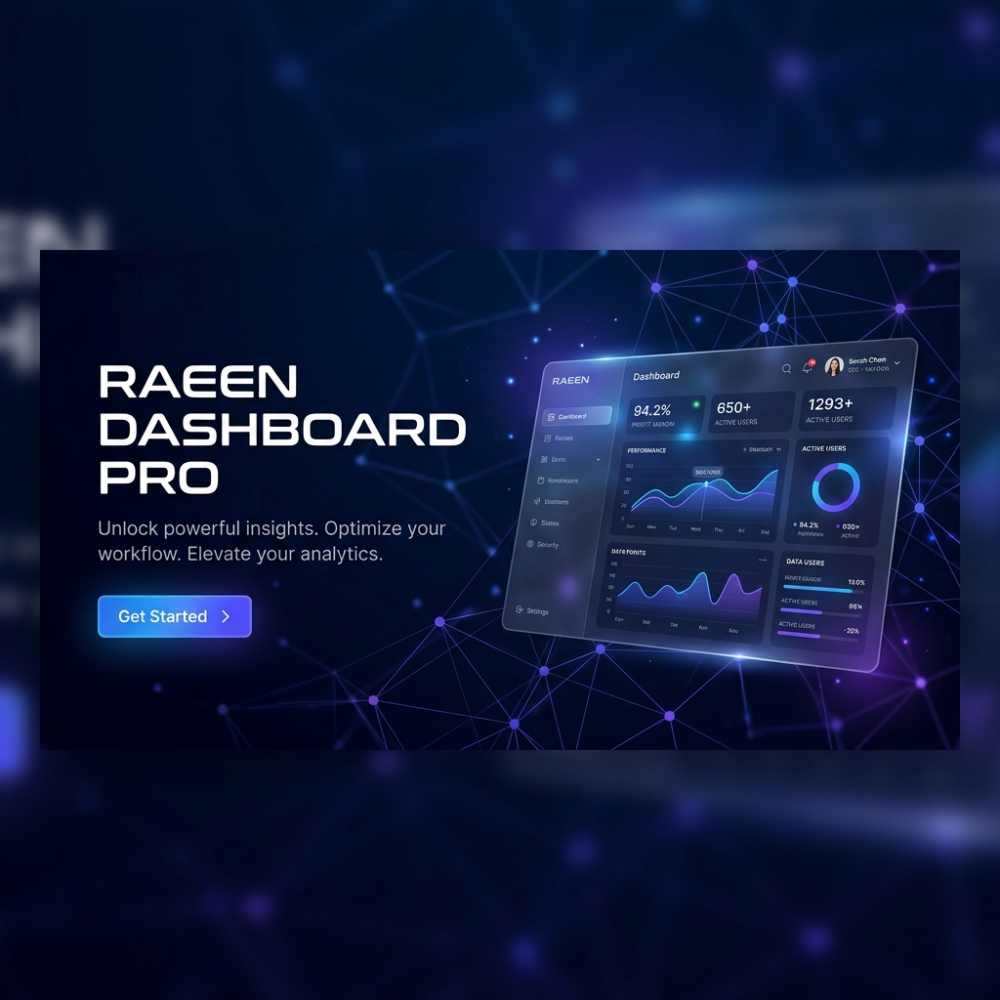
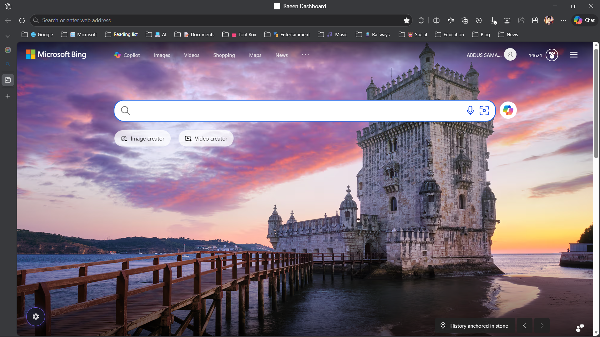
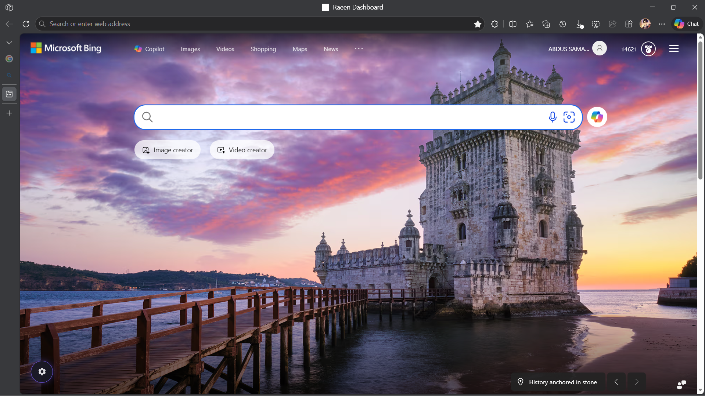
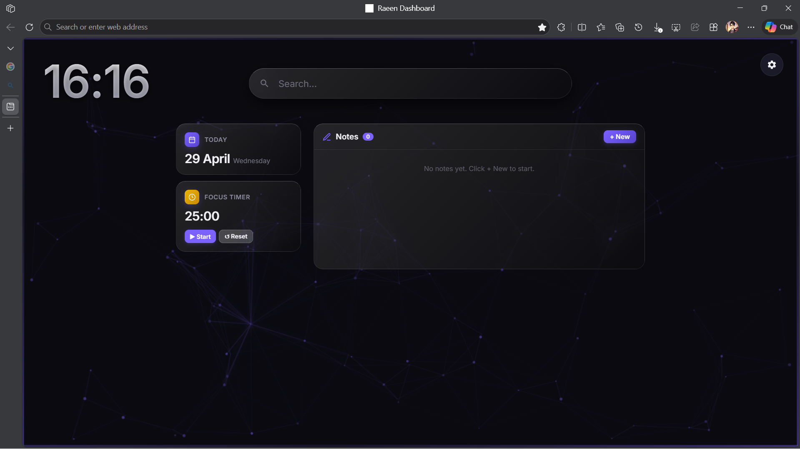

# Raeen Dashboard Pro v1.0.0

A premium, minimalist new tab dashboard for Chrome and Edge. Designed for productivity with integrated AI workflows, glassmorphism aesthetics, and high-performance search engine transitions.

## 📸 Gallery

  
  
  
  

## 🚀 Features

- **Native Search Redirect**: Seamlessly frame Google or Bing as your dashboard with persistent sign-in.
- **Zero-Flash Preloader**: High-speed logic that eliminates the 1-second visual delay during tab initialization.
- **AI-First Workflows**: Quick access to ChatGPT, Gemini, Claude, and Perplexity directly from the search bar.
- **Metasurface UI**: Premium glassmorphism design with dynamic "Neural" background engine.
- **Focus Mode & Quick Notes**: Built-in productivity tools to keep you on track.
- **Privacy First**: All settings are stored locally in your browser. No tracking, no data collection.

## 🛠️ Installation

### For Developers (Manual Load)
1. Clone this repository or download the ZIP.
2. Open Chrome and navigate to `chrome://extensions`.
3. Enable **Developer Mode** (top right).
4. Click **Load unpacked** and select this folder.

## 📦 Publishing Requirements (Chrome Web Store)

To publish this extension to the official store, ensure you have:
1. **Icons**: Add a `icons/` folder with `icon16.png`, `icon48.png`, and `icon128.png`.
2. **Screenshots**: At least 3 screenshots (1280x800 recommended).
3. **Privacy Policy**: A simple hosted page explaining that no data is collected.

## 📄 License
This project is licensed under the MIT License - see the [LICENSE](LICENSE) file for details.

---
Built with ❤️ by Abdussamad Raeen
